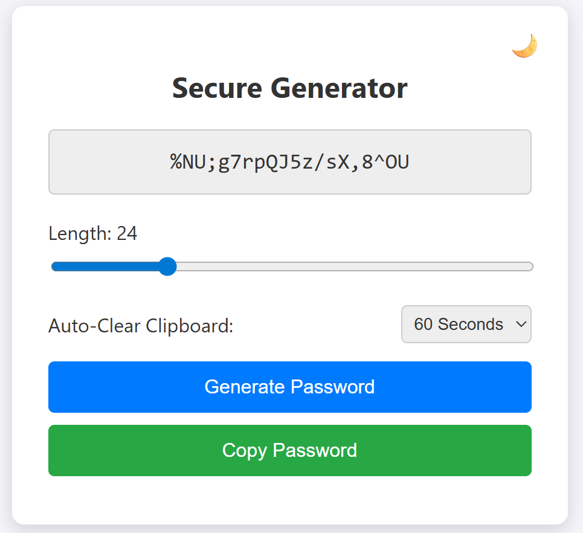

# 🔐 Homelab Vault: Secure Offline Password Generator

A hyper-secure, single-file offline password generator built specifically for self-hosting in a homelab environment. 

Unlike many online generators or complex Webpack-compiled tools, this generator uses pure Vanilla JavaScript and relies strictly on the Web Crypto API (`window.crypto.getRandomValues`) for OS-level entropy. It is designed to be hosted locally, completely air-gapped from the internet, with zero external dependencies or trackers.



## ✨ Features

* **True Cryptographic Security:** Uses `window.crypto.getRandomValues` instead of `Math.random()` or outdated ARC4 PRNGs.
* **Maximum Entropy:** Defaults to 20 characters and features an expanded 29-character symbol pool (`!@#$%^&*()-_=+[]{};:,.<>/?|~`).
* **Zero Dependencies:** No React, no Webpack, no external CDNs, and no telemetry. Just one clean `index.html` file containing HTML, CSS, and JS.
* **Air-Gap Ready:** Runs 100% client-side in the browser.
* **Modern UI:** Clean, responsive interface featuring a default Light Mode with a Dark Mode toggle.
* **1-Click Copy & Auto-Clear:** Native clipboard API integration with visual feedback and a customizable auto-clear timer (30s, 60s, 5m, or custom) to prevent passwords from lingering in memory.
* **Persistent Settings:** Uses local browser storage to securely remember your preferred theme, timer, and password length without ever talking to a server.

---

## 🖥️ Quick Start (Windows, Mac & Docker)

Because this application is a single static file with zero external dependencies, it does not require a complex web server to run. You can use it on any operating system using one of these three methods:

### Method 1: Local File Execution (Easiest, Air-Gapped)
You do not need a web server at all to use this securely.
1. Download the `index.html` file to your Windows or Mac machine.
2. Double-click the file to open it directly in your web browser (Chrome, Edge, Safari, Firefox).
3. The address bar will show `file:///.../index.html`. The Web Crypto API and local storage features work perfectly in this local context, ensuring maximum offline security.

### Method 2: Python Local Server (Quick Network Access)
If you want to quickly host the generator on your Mac or Windows machine so your phone or other local devices can access it, you can use Python (which is pre-installed on Macs and common on Windows).
1. Open your Terminal (Mac) or Command Prompt/PowerShell (Windows).
2. Navigate to the folder containing your `index.html` file.
3. Run the built-in HTTP server:
   ```bash
   python3 -m http.server 8000
   ```
### Method 3: Docker (Homelab Standard)
If you prefer containerization on Windows (via Docker Desktop) or Mac, you can instantly spin up a secure NGINX container hosting your file.

1. Navigate to the folder containing your index.html.
2. Run this single command to mount the file into a lightweight NGINX alpine container:
    ```bash
      docker run -d -p 8080:80 --name pass-gen -v $(pwd)/index.html:/usr/share/nginx/html/index.html:ro nginx:alpine
      ```
3. Open your browser and navigate to `http://localhost:8080`.

---

## 🚀 Advanced Deployment (Debian/Ubuntu LXC via NGINX)

Because this is a static, single-file application, it requires almost zero system resources. It is highly recommended to host this on a dedicated, unprivileged LXC container using NGINX.

### 1. Prepare the Environment
Update your system and install NGINX:
```bash
apt update && apt upgrade -y
apt install nginx git ufw -y
```

### 2. Deploy the Code
```bash
echo "Clearing old files and pulling your custom generator..."
rm -rf /var/www/html/*

git clone https://github.com/jakubgt/homelab-vault-gen.git /tmp/passgen

# Move the file and clean up
cp /tmp/passgen/index.html /var/www/html/index.html
rm -rf /tmp/passgen

echo "Deployment complete!"
```

### 3. Lock Down Permissions
Ensure the web server can only read the file, never modify it:
```bash
chown -R www-data:www-data /var/www/html
find /var/www/html -type d -exec chmod 555 {} \;
find /var/www/html -type f -exec chmod 444 {} \;
```

### 4. Hardening (Optional but Recommended)
For maximum security, configure NGINX to drop its version number, add security headers, and enforce a strict Content Security Policy (CSP) tailored for an inline single-file app:
```bash
# Hide NGINX version number
sed -i 's/# server_tokens off;/server_tokens off;/g' /etc/nginx/nginx.conf

# Add security headers and CSP
echo 'add_header X-Frame-Options "DENY";' > /etc/nginx/conf.d/security.conf
echo 'add_header X-Content-Type-Options "nosniff";' >> /etc/nginx/conf.d/security.conf
echo 'add_header X-XSS-Protection "1; mode=block";' >> /etc/nginx/conf.d/security.conf
echo "add_header Content-Security-Policy \"default-src 'none'; script-src 'unsafe-inline'; style-src 'unsafe-inline'; base-uri 'none'; form-action 'none';\";" >> /etc/nginx/conf.d/security.conf

nginx -t && systemctl restart nginx
```

### 5. Lock down the firewall to only accept web traffic:
```bash
ufw default deny incoming
ufw default allow outgoing
ufw allow 80/tcp
ufw enable
```

## 🧠 Why Build This?
Many open-source password generators are either bloated with frameworks, pull external fonts/scripts from CDNs, or use legacy math functions that do not provide cryptographically secure pseudorandom numbers (CSPRNG).

This project strips everything away to leave only the bare essentials: a mathematically sound window.crypto algorithm wired to a simple, indestructible UI. It's the perfect utility to embed in a local network for generating passwords for new Docker containers, VMs, or databases.

## 📄 License
This project is open-source and available under the MIT License. Feel free to fork, modify, and host it in your own labs!
