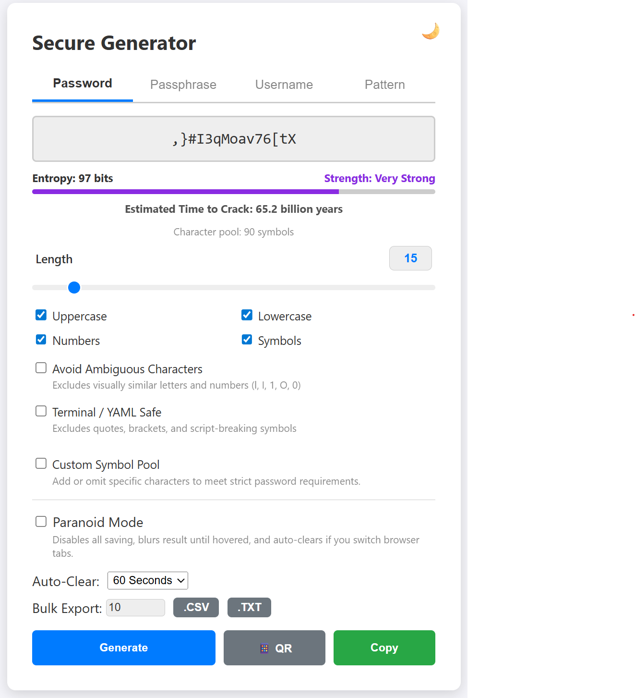

<p align="center">
  
</p>

# 🔐 Homelab Vault: Secure Offline Password & Passphrase Generator


A hyper-secure, offline password and diceware generator built specifically for self-hosting in a homelab environment. 

Unlike many online generators or complex Webpack-compiled tools, this generator uses pure Vanilla JavaScript and relies strictly on the Web Crypto API. It has been architecturally hardened to support a bulletproof Content Security Policy (CSP) with zero inline scripts or styles. It is designed to be hosted locally, completely air-gapped from the internet, with zero external dependencies, CDNs, or trackers.

<p align="center">
  
</p>

## ✨ Features

* **True Cryptographic Security & Memory Safety:** Uses `window.crypto.getRandomValues` combined with **Rejection Sampling** to completely eliminate modulo bias. Generation is performed directly within a `Uint8Array` memory buffer, completely eliminating intermediate string allocations that would otherwise linger in the browser's memory heap.
* **Username Generation:** Create clean usernames by securely combining random words from the built-in dictionary, complete with custom separators and optional randomized number suffixes.
* **Passphrase / Diceware Mode:** Generate memorable, mathematically secure passphrases using a built-in dictionary, complete with custom separators, capitalization, and number injection.
    * **Diceware Mode:** Specifically utilizes the full 7,776-word EFF Large Wordlist.
* **Pattern / Regex Generation:** Create credentials matching exact structural requirements using regex-style patterns (e.g., `[A-Z]{3}-[0-9]{4}-[a-z]{5}`). Perfect for enterprise policies, API keys, or legacy mainframes requiring highly specific formats.
* **Character Class Guarantees & Custom Symbols:** Enforces enterprise-grade security by **guaranteeing** that at least one character from every selected set (Uppercase, Lowercase, Numbers, Symbols) is included in every generated password. 
    * Includes a **Custom Symbol Pool** input and a **"Safe Symbols" Toggle** to quickly filter out characters commonly rejected by legacy systems (e.g., brackets, quotes).
* **Advanced Entropy & Crack-Time Meter:** Calculates bit-entropy from charset size and length:
  $$H = L \cdot \log_{2}(N)$$
  Where $L$ is length and $N$ is the charset size. For passphrase mode the meter deliberately rounds **conservative** (it does not count entropy an attacker could infer from the visible output structure), so the displayed number is a floor, not a ceiling. The meter dynamically displays plain-English **Strength Classifications** and estimates **Time to Crack** (based on a modern cracking speed of 100 billion guesses per second).
* **Cryptographic Memory Wiping & Paranoid Mode:**
    * **Memory Shredding:** When the Auto-Clear timer finishes or Paranoid Mode detects you have switched browser tabs/minimized the window, the app actively shreds the secret by overwriting the memory addresses with cryptographic noise, zeroing them out, and clearing the DOM.
    * **Visual Privacy:** Blurs the password on-screen until hovered.
    * **Zero-Persistence:** Disables all `localStorage` saving while active to ensure no trace of your activity remains.
* **Strict Content Security Policy (CSP):** Full architectural separation of HTML, CSS, and JS allows for a total ban on `'unsafe-inline'` executions and external calls.
* **Persistent Settings:** When Paranoid Mode is inactive, the app securely remembers your preferred theme, auto-clear timer, and character toggles.
* **Precision Length Controls:** Features a manual numeric input and full-width slider for exact counts — characters (4–128) in password mode, words in passphrase (3–20) and username (1–10) modes.
* **Keyboard Shortcuts:** Instantly generate a new password, passphrase, or username at any time simply by pressing the `Spacebar`.
* **Air-Gapped QR Code Export:** Instantly render generated credentials as a high-contrast QR code directly on your screen. This allows you to securely scan passwords into a mobile device's authenticator or password manager using the camera, completely bypassing the clipboard and local network. For enhanced visual security, the generated `<canvas>` element is completely destroyed and purged from the DOM the moment the modal is closed—rather than just clearing its 2D context—ensuring absolutely zero visual residue remains in memory.
* **Bulk Generation & Export:** Generate up to 10,000 credentials simultaneously. Export the results instantly as `.CSV` or `.TXT` files directly from client-side memory using Blob URLs, ensuring no bulk data ever touches a backend server.

---

## 🛡️ Threat Model

To ensure this tool fits your security requirements, please review its intended scope.

### This project PROTECTS against:
* **Weak PRNGs:** Uses OS-level entropy to eliminate predictable generation patterns.
* **Online Leakage:** Your passwords never touch a network or a remote server; all logic is client-side.
* **No Telemetry:** Zero external calls or dependencies means no "supply chain" script injections.
* **Interception:** Secrets cannot be sniffed in transit because the tool operates entirely locally.

### This project does NOT protect against:
* **Compromised Browsers:** A hijacked browser or malicious profile can see everything you generate.
* **OS-Level Malware:** Keyloggers or screen-recorders bypass all web-application security layers.
* **Clipboard History:** Clipboard auto-clear is "best-effort"; OS-level clipboard managers may still retain copies.
* **Malicious Extensions:** Browser extensions often have permissions to read data directly from the screen.

---

## 🖥️ Quick Start (Docker, Windows, Mac)

Because this application relies entirely on client-side code with zero external dependencies, it is incredibly easy to deploy.

### Method 1: Local File Execution (Air-Gapped, easiest)
You do not need a web server at all to use this securely.

1. Download the repository folder to your Windows or Mac machine.
2. Unzip the contents of the repository
3. Double-click index.html to open it directly in your web browser (Chrome, Edge, Safari, Firefox).

### Method 2: Docker Compose 
The repository includes a hardened NGINX configuration and a `docker-compose.yml` file. This drops all container privileges, mounts the files as read-only, and applies strict security headers.

1. Clone or download the repository.
2. Navigate to the folder in your terminal.
3. Run:
   ```bash
   docker compose up -d
   ```
4. Access the generator at http://localhost:8080 (or your server's IP)

> 💡 The container uses `network_mode: host` and the unprivileged NGINX image listens on port **8080**, so no bridge configuration is needed. Adjust your firewall accordingly if you expose it on the network.

### Method 3: Python Local Server (Quick Network Access)
If you want to quickly host the generator on your machine so other local devices can access it:

1. Open your Terminal or Command Prompt.
2. Navigate to the repository folder.
3. Run the built-in HTTP server:
   ```bash
   python3 -m http.server 8000
   ```

---

### 🌐 Advanced Deployment (Caddy with Automatic HTTPS) [Recommended]

> **Pick one Advanced Deployment method.** This Caddy path and the NGINX path below are alternatives — don't run both on the same host. The repo includes a `Caddyfile` with three options (localhost, local network, public domain); you pick one when you configure it.

### 1. Install Caddy
Official Debian/Ubuntu repository:
```bash
sudo apt install -y debian-keyring debian-archive-keyring apt-transport-https curl git ufw
curl -1sLf 'https://dl.cloudsmith.io/public/caddy/stable/gpg.key' | sudo gpg --dearmor -o /usr/share/keyrings/caddy-stable-archive-keyring.gpg
curl -1sLf 'https://dl.cloudsmith.io/public/caddy/stable/debian.deb.txt' | sudo tee /etc/apt/sources.list.d/caddy-stable.list
sudo apt update && sudo apt install -y caddy
```

### 2. Deploy the Code and Caddyfile
```bash
# Create the web directory and empty it
sudo mkdir -p /var/www/html
sudo rm -rf /var/www/html/*

# Pull the generator
git clone https://github.com/jakubgt/homelab-vault-gen.git /tmp/passgen

# Copy application assets while excluding repository metadata and config files
sudo rsync -av --exclude={'.git','.github','README.md','LICENSE','tests.yml','test.js','docker-compose.yml','Caddyfile','nginx.conf'} /tmp/passgen/ /var/www/html/

# Copy the Caddyfile to the system directory
sudo cp /tmp/passgen/Caddyfile /etc/caddy/Caddyfile

# Clean up the temporary clone directory
sudo rm -rf /tmp/passgen

# Securely set ownership and permissions for the Caddy web root
sudo chown -R caddy:caddy /var/www/html
sudo find /var/www/html -type d -exec chmod 755 {} \;
sudo find /var/www/html -type f -exec chmod 644 {} \;

echo "Deployment complete!"
```

### 3. Choose Your Deployment Mode
To choose your deployment mode, open the `Caddyfile`:
> **💡 Note:** The `Caddyfile` is **pre-configured by default for Option 2 (Local Network Access)**. If this fits your environment, you do not need to make any changes.
```bash
sudo nano /etc/caddy/Caddyfile
```
If you require a different deployment method, ensure exactly one site block is uncommented at a time:

* **Option 1 — `localhost` only** (zero-config, single machine): Caddy automatically trusts its own cert on the local machine. Best for trying the tool out before going further.
* **Option 2 — local network** (LAN IP or `*.lan` hostname): Replace `vault.lan` in the Caddyfile with your server's IP or local hostname. Clients on *other* devices will see a browser warning until you install Caddy's root CA on them; the cert lives at `/var/lib/caddy/.local/share/caddy/pki/authorities/local/root.crt`. Right choice if you want HTTPS on a private network without a domain.
* **Option 3 — public domain** (auto Let's Encrypt): Replace `vault.example.com` in the Caddyfile with your real domain. Requires DNS A/AAAA records and ports 80/443 reachable from the internet. No browser warnings.

Validate the syntax before starting the service:
```bash
sudo caddy validate --config /etc/caddy/Caddyfile
```

### 4. Start Caddy
```bash
sudo systemctl enable --now caddy
sudo systemctl restart caddy
```

To watch live logs while you test:
```bash
sudo journalctl -u caddy -f
```

### 5. Firewall
```bash
sudo ufw default deny incoming
sudo ufw default allow outgoing
sudo ufw allow 443/tcp    # HTTPS
sudo ufw allow 80/tcp     # required for Option 3's Let's Encrypt renewals
sudo ufw --force enable
```

> 💡 **Tailscale users:** If your server is on a Tailscale network, Caddy can fetch a real Let's Encrypt cert for your `*.your-tailnet.ts.net` hostname using Tailscale's MagicDNS, with no public DNS or open inbound ports required. See the [Caddy + Tailscale guide](https://tailscale.com/kb/1190/caddy-certificates) for the extra config.

### 🌐 Advanced Deployment (Alternative — NGINX for plain HTTP/Reverse Proxies)
If you already use a reverse proxy (like NGINX Proxy Manager, Traefik, or Cloudflare Tunnels) that handles HTTPS for you, or if you strictly only need plain HTTP, deploy this on a dedicated, unprivileged Debian/Ubuntu LXC container using NGINX. This method applies the strict CSP headers but leaves TLS management up to your external proxy.

> **Pick one Advanced Deployment method.** This NGINX path and the Caddy path above are alternatives — don't run both on the same host.

### 1. Prepare the Environment
Update your system and install NGINX and Git:
```bash
sudo apt update && sudo apt upgrade -y
sudo apt install nginx git ufw -y
```

### 2. Deploy the Code
```bash
# Ensure the target directory exists and clear existing files
sudo mkdir -p /var/www/html
sudo rm -rf /var/www/html/*

# Clone the repository
git clone https://github.com/jakubgt/homelab-vault-gen.git /tmp/passgen

# Copy application assets while excluding repository metadata and config files
sudo rsync -av --exclude={'.git','.github','README.md','LICENSE','tests.yml','test.js','docker-compose.yml','Caddyfile','nginx.conf'} /tmp/passgen/ /var/www/html/

# Copy the NGINX configuration to the system directory and reload
sudo cp /tmp/passgen/nginx.conf /etc/nginx/conf.d/vault.conf
sudo systemctl reload nginx

# Purge temporary files
sudo rm -rf /tmp/passgen

echo "Deployment complete!"
```

### 3. Lock Down Permissions
Ensure the web server can only read the files, never modify them:
```bash
sudo chown -R www-data:www-data /var/www/html
sudo find /var/www/html -type d -exec chmod 755 {} \;
sudo find /var/www/html -type f -exec chmod 644 {} \;
```

### 4. Hardening (Optional but Recommended)
For maximum security, configure NGINX to drop its version number, add isolation headers, and enforce a strict Content Security Policy tailored for this split-file app:
```bash
# Hide NGINX version number
sudo sed -i 's/# server_tokens off;/server_tokens off;/g' /etc/nginx/nginx.conf

# Add security headers and strict CSP
cat << 'EOF' | sudo tee /etc/nginx/conf.d/security.conf
add_header X-Frame-Options "DENY" always;
add_header X-Content-Type-Options "nosniff" always;
add_header Referrer-Policy "no-referrer" always;
add_header Permissions-Policy "clipboard-read=(), clipboard-write=(self)" always;
add_header Cross-Origin-Opener-Policy "same-origin" always;
add_header Cross-Origin-Resource-Policy "same-origin" always;
add_header Content-Security-Policy "default-src 'none'; script-src 'self'; style-src 'self'; img-src 'data:' 'self'; base-uri 'none'; form-action 'none'; frame-ancestors 'none';" always;
EOF

sudo nginx -t && sudo systemctl restart nginx
```

### 5. Lock down the firewall to only accept web traffic:
```bash
sudo ufw default deny incoming
sudo ufw default allow outgoing
sudo ufw allow 80/tcp
sudo ufw --force enable
```

### 6. Enable Auto-Start on Boot:
```bash
sudo systemctl enable nginx
```

## 🧪 Testing & Verification

This project ships a zero-dependency test suite that *proves* its core claims rather than asserting them. 

**Automated Validation:** The `.github/workflows` CI/CD pipeline automatically verifies our test suite on every code push. You can view the live status and full history of all test runs [here](https://github.com/jakubgt/homelab-vault-gen/actions). 
**Status:** 

**Manual Validation:** Run with Node (no installation needed):

```bash
node test.js
```

It validates:
- **RNG uniformity** via a chi-squared test — the actual evidence that
  rejection sampling eliminates modulo bias.
- **Strict character-class enforcement** across thousands of generated passwords.
- **Wordlist integrity** (7,776 unique EFF words), which backs the passphrase
  entropy figure.
- **Entropy math** against hand-computed values.

## 🧠 Why Build This?
Many open-source password generators are either bloated with frameworks, pull external fonts/scripts from CDNs, or use naive generation logic (like standard modulo math) that introduces cryptographic bias.

This project strips everything away to leave only the bare essentials: mathematically sound rejection sampling wired to a bulletproof, indestructible UI. It's the perfect utility to embed in a local network for generating secure credentials for new Docker containers, VMs, or databases.

### 🖼️ Dashboard Icon
If you are adding this generator to a personal homelab startpage or dashboard (such as Heimdall, Homarr, Dashy, or Organizr), you can use this raw URL to fetch the high-resolution transparent icon directly:

```text
https://raw.githubusercontent.com/jakubgt/homelab-vault-gen/main/assets/vault-icon.png
```

## 📄 License
This project is open-source and available under the MIT License. Feel free to fork, modify, and host it in your own labs!
